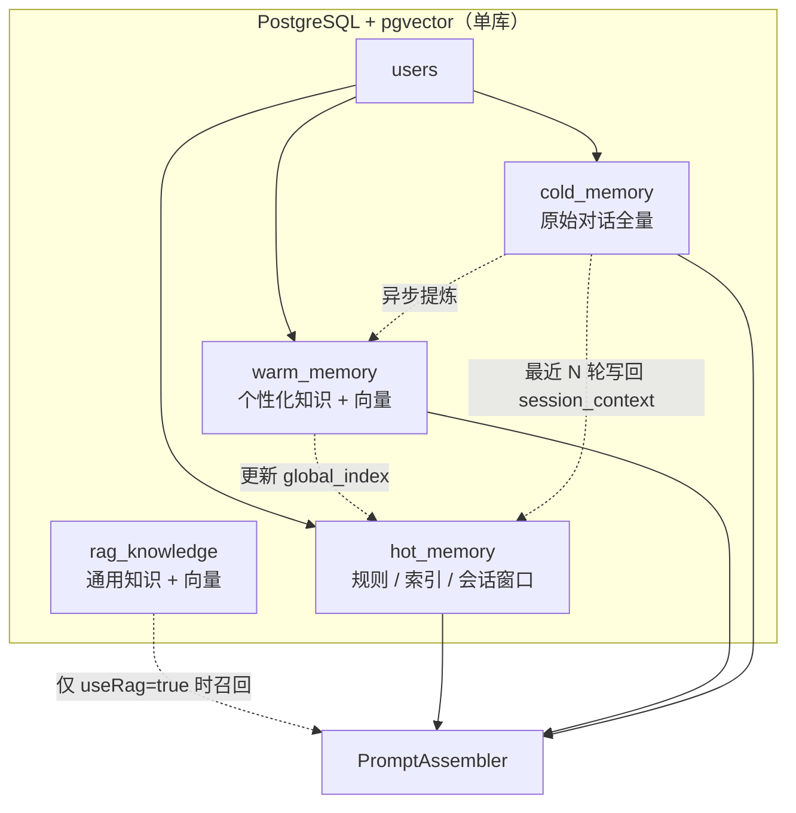
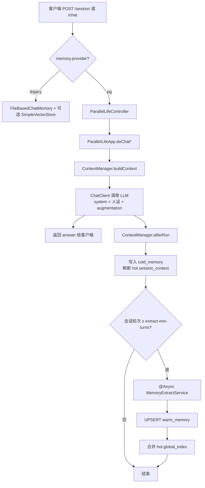
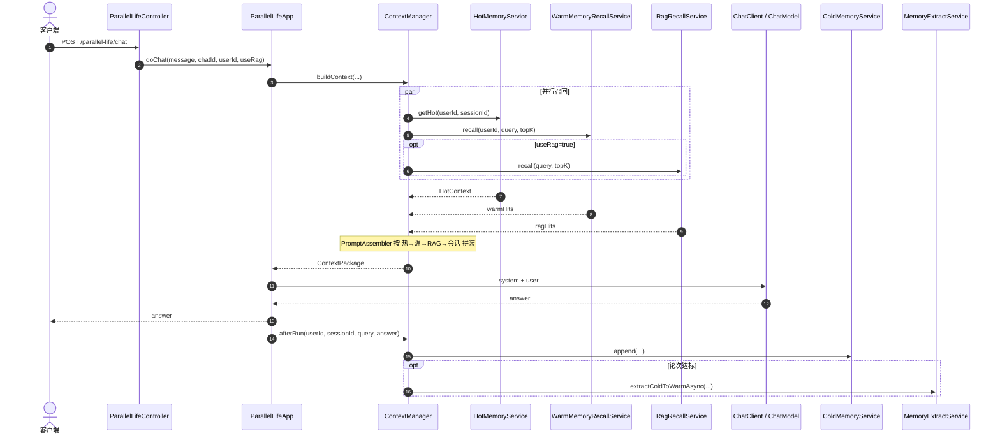
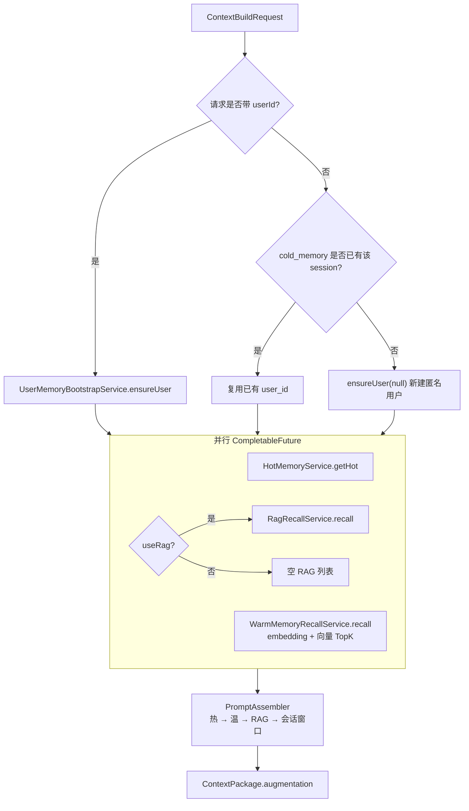
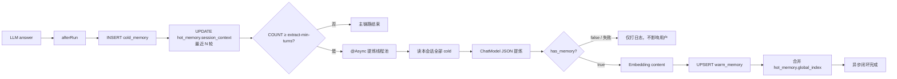
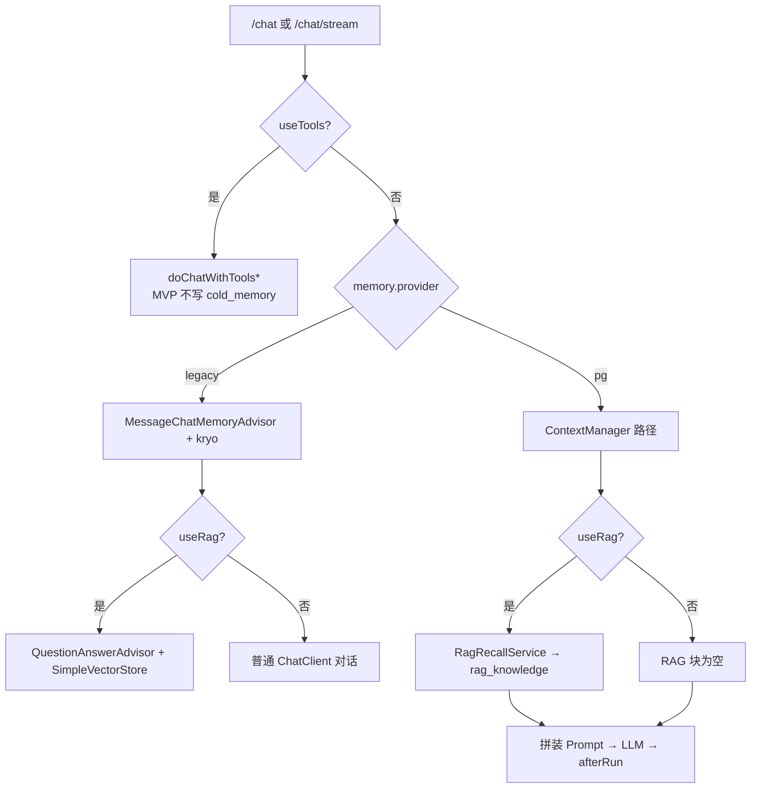

# 三层记忆 MVP — 代码实现与全链路说明

> **文档性质**：对照当前仓库**已落地代码**的实现讲解与请求全链路说明（非设计蓝图）。  
> **实现范围**：单库 PostgreSQL + pgvector MVP（见 `07-计划与任务/三层记忆MVP分步开发计划.md`）。  
> **状态**：代码与编译已就绪；默认 `memory.provider=legacy`；**实库联调 / Scenario A–C 验收尚未完成**。  
> **包根**：`com.qin.qaiagentproject`

**流程图索引（Mermaid，预览本 Markdown 即可渲染）**

| 图 | 位置 | 内容 |
| --- | --- | --- |
| 图 4.1 | §4.1 | 五表与热/温/冷/RAG 关系 |
| 图 A | §5.1 | 一次对话主链路 flowchart |
| 图 B | §5.1 | 组件协作 sequence |
| 图 C | §5.3 | userId 解析 + 并行召回 + Prompt 拼装 |
| 图 D | §5.5 | afterRun 与冷→温→热 |
| 图 E | §6 | pg / legacy / tools 入口分流 |

---

## 1. 一句话结论

当 `memory.provider=pg` 时，一次对话会走：

**确保用户 → 并行召回（热 / 温 / RAG）→ Prompt 拼装 → LLM → 写冷记忆 →（会话轮次达标后）异步冷→温→热提炼**。

当 `memory.provider=legacy`（默认）时，仍走原来的 `FileBasedChatMemory`（kryo）+ 可选 `SimpleVectorStore`，与改造前行为一致，便于回滚演示。

---

## 2. 与设计文档的边界

| 文档 | 角色 |
| --- | --- |
| `封装三层记忆模型落地方案(最终标准)` | 生产级蓝图（Redis / 多库 / MQ 等），**非本次代码范围** |
| `三层记忆MVP分步开发计划.md` | 七步开发计划与验收清单 |
| `三层记忆单库PG-本仓库代码落地方案.md` | 改造前的类清单规划 |
| **本文** | **已实现代码**怎么跑、类在哪、链路怎么串 |

MVP **刻意不做**：Redis 热缓存、MySQL 拆分、Outbox/MQ、跨会话冷检索、温记忆引导 RAG（模式 2/3/4）、工具路径写冷记忆、AgentLoop 多步编排。

仍遵守的铁则：

1. **先写冷**：回答完成后先落 `cold_memory`，再触发上层更新  
2. **单向流动**：冷 → 温 → 热，禁止反向  
3. **召回优先级在 Prompt 中的顺序**：热 → 温 → RAG → 当前会话冷窗口  
4. **异步解耦**：提炼不阻塞用户回复  
5. **边界清晰**：`rag_knowledge` 存通用知识，`warm_memory` 存用户个性化内容  

---

## 3. 包结构与类职责

```plain
com.qin.qaiagentproject
├── config/
│   ├── MemoryProperties.java          # memory.* 配置绑定
│   ├── MemoryConfig.java              # 启用 ConfigurationProperties
│   ├── AsyncConfig.java               # @EnableAsync + memoryExtractExecutor
│   └── PgMemoryDataSourceConfig.java  # provider=pg 时 DataSource / JdbcTemplate / Flyway
├── context/
│   ├── ContextBuildRequest.java       # userId / sessionId / message / useRag
│   ├── ContextPackage.java            # 各块文本 + augmentation
│   ├── PromptAssembler.java           # 固定顺序拼装 Prompt 增强段
│   └── ContextManager.java            # buildContext + afterRun（Memory Manager）
├── memory/
│   ├── repository/                    # JdbcTemplate 访问五张表
│   │   ├── UserRepository
│   │   ├── HotMemoryRepository
│   │   ├── ColdMemoryRepository
│   │   ├── WarmMemoryRepository
│   │   └── RagKnowledgeRepository
│   └── service/
│       ├── UserMemoryBootstrapService # users + hot_memory 初始化
│       ├── HotMemoryService           # 读规则/索引 + 最近 N 轮冷文本
│       ├── ColdMemoryService          # append 冷记忆并刷新 session_context
│       ├── EmbeddingService           # EmbeddingModel → PG vector 字面量
│       ├── WarmMemoryRecallService    # 温记忆向量 TopK
│       ├── RagRecallService           # RAG 向量 TopK
│       ├── MemoryExtractService       # @Async 冷→温→热
│       └── RagKnowledgeSeedLoader     # 启动时空表灌 document/*.md
└── （改造）
    ├── app/ParallelLifeApp.java
    ├── controller/ParallelLifeController.java
    ├── dto/ChatRequest.java           # 新增可选 userId
    └── rag/ParallelLifeVectorStoreConfig.java  # 仅 legacy 装配
```

几乎所有三层记忆 Bean 带有：

```java
@ConditionalOnProperty(name = "memory.provider", havingValue = "pg")
```

因此 **legacy 模式不会加载数据源与记忆服务**（主应用本身也 exclude 了 `DataSourceAutoConfiguration`，由 `PgMemoryDataSourceConfig` 在 pg 模式下手工装配）。

---

## 4. 数据模型（单库五表）

Flyway 脚本：`src/main/resources/db/migration/V1__init_three_layer_memory.sql`  
权威表设计对齐：`02-架构与方案/简化实现方案.md` 第四节。

| 表 | 角色 | 关键字段 |
| --- | --- | --- |
| `users` | 用户 | `user_id`, `username` |
| `hot_memory` | 热：规则 + 索引 + 会话窗口缓存 | `global_rules`, `session_context`, `global_index` (jsonb) |
| `warm_memory` | 温：用户结构化知识 + 向量 | `topic_name`, `content`, `scene`, `content_vector(1536)` |
| `cold_memory` | 冷：原始对话全量 | `session_id`, `query`, `answer` |
| `rag_knowledge` | 通用 RAG 切片 + 向量 | `doc_title`, `doc_chunk`, `doc_vector(1536)` |

向量维度约定：`memory.embedding-dimensions=1536`，须与 DashScope embedding 实际维度一致。

### 4.1 表与记忆层级关系



---

## 5. 全链路时序（pg 模式）

### 5.1 总览

#### 图 A：一次对话主链路（flowchart）



#### 图 B：组件协作（sequence）



文字版（与上图等价，便于纯文本阅读）：

```plain
客户端
  │
  ├─① POST /api/parallel-life/session
  │     └─ UserMemoryBootstrapService.ensureUser
  │           → INSERT users / hot_memory（若不存在）
  │           → 返回 chatId(=sessionId) + userId
  │
  └─② POST /api/parallel-life/chat  （或 /chat/stream）
        │  body: message, chatId, userId?, useRag?
        ▼
ParallelLifeController
        │
        ▼
ParallelLifeApp.doChat / doChatStream
        │  memory.provider == pg ?
        ▼
doChatWithPgMemory / doChatStreamWithPgMemory
        │
        ├─③ ContextManager.buildContext
        │     ├─ 解析/复用 userId（见 5.3）
        │     ├─ 并行：Hot / Warm /（可选）RAG
        │     └─ PromptAssembler → ContextPackage.augmentation
        │
        ├─④ ChatClient：system = 人设 + augmentation，user = message
        │
        └─⑤ ContextManager.afterRun
              ├─ ColdMemoryService.append → cold_memory
              │     └─ 同步刷新 hot_memory.session_context（最近 N 轮）
              └─ 若会话轮次 ≥ extract-min-turns
                    └─ MemoryExtractService.extractColdToWarmAsync
                          ├─ LLM JSON 提炼
                          ├─ UPSERT warm_memory + 向量
                          └─ 合并 hot_memory.global_index
```

### 5.2 创建会话（①）

- 接口：`POST /api/parallel-life/session`
- `chatId`：服务端 `UUID.randomUUID()`，对应库中 `cold_memory.session_id`
- pg 下调用 `UserMemoryBootstrapService.ensureUser(userIdHint)`：
  - 合法 UUID → 按该 id 建用户（不存在则插入）
  - 非 UUID 字符串 → 按 `username` 查找或新建
  - 空 → 匿名用户 `anon-{uuid前8位}`
- 响应中的 `userId` 建议前端持久化，后续对话一并上传

### 5.3 构建上下文（③）

入口：`ContextManager.buildContext(ContextBuildRequest)`。

#### 图 C：userId 解析 + 并行召回 + Prompt 拼装



**userId 解析策略**：

1. 请求带了 `userId` → `ensureUser`
2. 未带 → 查该 `session_id` 是否已有冷记忆，有则复用其 `user_id`，否则新建匿名用户  

避免「同一会话每轮新建用户」导致冷/温记忆断裂。

**并行召回**（`CompletableFuture` + 固定 3 线程池）：

| 分支 | 服务 | 条件 |
| --- | --- | --- |
| Hot | `HotMemoryService.getHot` | 始终：`global_rules` + `global_index` + 最近 `cold-recent-rounds` 条冷记忆文本 |
| Warm | `WarmMemoryRecallService.recall` | 始终：query embedding → `warm_memory` 按 `<->` TopK |
| RAG | `RagRecallService.recall` | 仅 `useRag=true`：query embedding → `rag_knowledge` TopK |

任一召回失败会在对应 Service 内打日志并**降级为空列表/空块**，不阻断主链路。

**Prompt 拼装顺序**（`PromptAssembler`）：

1. `【热记忆 / 用户全局规则与索引】`  
2. `【温记忆 / 用户个性化知识】`  
3. `【RAG 知识库】`  
4. `【当前会话上下文（最近轮次）】`  

拼好的字符串写入 `ContextPackage.augmentation`，由 `ParallelLifeApp` 接到系统人设后面：

```text
SYSTEM_PROMPT
+ 「以下是与当前用户相关的记忆与知识…」
+ augmentation
```

用户问题仍放在 `.user(message)`，避免与增强段混淆。

### 5.4 调用 LLM（④）

- pg 模式构建的 `ChatClient`**不挂** `MessageChatMemoryAdvisor`，避免与 `cold_memory` 双写会话历史  
- 仍保留 `MyLoggerAdvisor`、`ForbiddenWordAdvisor`  
- 非流式：`.call()` 拿全文后立即 `afterRun`  
- 流式：首 token 前完成 `buildContext`；`doOnNext` 拼全文，`doOnComplete` 再 `afterRun`

### 5.5 写冷与异步提炼（⑤）

#### 图 D：afterRun 与冷→温→热（单向）



`afterRun`：

1. `ColdMemoryService.append` → `INSERT cold_memory`  
2. 用最近 N 轮冷记忆刷新 `hot_memory.session_context`  
3. `COUNT` 本会话轮次；若 `≥ memory.extract-min-turns`（默认 2）→  
   `MemoryExtractService.extractColdToWarmAsync`（线程池 `memory-extract-*`）

提炼逻辑摘要：

1. 读出该会话全部冷记忆拼成对话文本  
2. 用 `ChatModel` + 固定 JSON Prompt 抽取 `topic_name / scene / content / importance`  
3. `has_memory=false` 或解析失败 → 直接返回（仅日志）  
4. 对 `content` 做 embedding，`UPSERT warm_memory`（冲突键：`user_id + topic_name`）  
5. `jsonb_build_object` 合并更新 `hot_memory.global_index`

---

## 6. 双模式对照（pg vs legacy）

#### 图 E：入口分流




| 能力 | `memory.provider=pg` | `memory.provider=legacy`（默认） |
| --- | --- | --- |
| 会话记忆 | `cold_memory` + Prompt 注入 | `FileBasedChatMemory` + `MessageChatMemoryAdvisor` |
| RAG | `RagRecallService` → `rag_knowledge` | `QuestionAnswerAdvisor` + `SimpleVectorStore` |
| 温/热 | 有 | 无 |
| 数据源 / Flyway | `PgMemoryDataSourceConfig` 装配 | 不装配 |
| `ParallelLifeVectorStoreConfig` | 不加载 | 加载 |
| 工具对话 `doChatWithTools*` | MVP **未**写冷记忆 | 仍用 kryo 记忆参数 |

切换方式：复制 `src/main/resources/application-local.yml.example` 为本地 `application-local.yml`（已 gitignore），设置 `memory.provider: pg` 与数据源。

主配置默认值见 `application.yml`：

```yaml
memory:
  provider: legacy
  warm-top-k: 3
  rag-top-k: 3
  cold-recent-rounds: 3
  extract-min-turns: 2
  embedding-dimensions: 1536
  seed-rag-on-startup: true
```

---

## 7. 关键改造点（现有类）

### 7.1 `ParallelLifeController`

- `/chat`、`/chat/stream`：把 `userId`、`useRag` 传入 `ParallelLifeApp`；工具路径仍单独分支  
- `/session`：pg 下 bootstrap 用户并回写 `userId`

### 7.2 `ParallelLifeApp`

- 构造时按 `MemoryProperties` 决定是否挂 `MessageChatMemoryAdvisor`  
- `doChat` / `doChatStream` 重载：`(message, chatId, userId, useRag)`  
- pg：`doChatWithPgMemory` / `doChatStreamWithPgMemory`  
- legacy + RAG：走原 `QuestionAnswerAdvisor` 路径  

### 7.3 `ChatRequest`

新增可选字段 `userId`（字符串 UUID；可空）。

### 7.4 RAG 种子

`RagKnowledgeSeedLoader` 在 `ApplicationReadyEvent` 时：若 `seed-rag-on-startup=true` 且 `rag_knowledge` 为空，则加载 `classpath:document/*.md`，切片 embedding 后写入表（有上限，避免启动过慢）。

---

## 8. API 调用示例（pg）

> 实际 context-path 为 `/api`（见 `application.yml`）。

**创建会话**

```http
POST /api/parallel-life/session
Content-Type: application/json

{}
```

响应中取 `chatId`、`userId`。

**多轮对话**

```http
POST /api/parallel-life/chat
Content-Type: application/json

{
  "message": "我25岁，程序员，偏好稳健职业路径，不考虑创业",
  "chatId": "<session-uuid>",
  "userId": "<user-uuid>",
  "useRag": false,
  "useTools": false
}
```

**带 RAG**

将 `useRag` 设为 `true`（需库中已有 `rag_knowledge` 向量数据）。

**库内自检（手工）**

```sql
SELECT * FROM cold_memory WHERE session_id = '<session-uuid>';
SELECT * FROM warm_memory WHERE user_id = '<user-uuid>';
SELECT global_index FROM hot_memory WHERE user_id = '<user-uuid>';
SELECT doc_title FROM rag_knowledge LIMIT 5;
```

---

## 9. 验收对照（计划附录）

| Scenario | 期望 | 当前 |
| --- | --- | --- |
| A 冷记忆累积 | 同 session 两轮对话后 `cold_memory` 两行 | 待实库验证 |
| B 温记忆沉淀 | ≥2 轮后异步出现 `warm_memory`，相关提问 Warm 块非空 | 待实库验证 |
| C RAG 增强 | `useRag=true` 且 seed 存在时回答能引用知识库 | 待实库验证 |
| legacy 回滚 | `provider=legacy` 行为与改造前一致 | 默认模式；建议抽测 |

编译与单测：`mvn compile`、`PromptAssemblerTest` 已通过（拼装顺序与空块降级）。

---

## 10. 面试 / 演示可讲要点

1. **为什么单库**：个人项目优先闭环；用表分工代替 Redis + 向量库 + MySQL。  
2. **为什么先写冷**：完整事实源在冷层；温/热由提炼产生，可重跑、可失败降级。  
3. **为什么 pg 去掉 MessageChatMemoryAdvisor**：会话真相源改到 `cold_memory`，避免双写不一致。  
4. **降级策略**：向量/提炼失败只打日志，用户仍能拿到 LLM 回复；配置一键回 legacy。  
5. **与生产方案关系**：本实现是「可演示 MVP」；扩展路线见最终标准方案与仓库内 DDL/MQ 文档。

---

## 11. 相关文件速查

| 路径 | 说明 |
| --- | --- |
| `src/main/resources/db/migration/V1__init_three_layer_memory.sql` | DDL |
| `src/main/resources/application-local.yml.example` | pg 本地配置模板 |
| `src/main/java/.../context/ContextManager.java` | 编排中枢 |
| `src/main/java/.../app/ParallelLifeApp.java` | 对话入口双模式 |
| `src/main/java/.../memory/service/MemoryExtractService.java` | 异步提炼 |
| `docs-back/07-计划与任务/三层记忆MVP分步开发计划.md` | 开发计划与 E2E 用例 |
| `docs-back/02-架构与方案/简化实现方案.md` | DDL 与提炼 Prompt 来源 |

---

## 12. 后续建议

1. 完成本地 PG + pgvector 联调，勾选 Scenario A/B/C  
2. 工具路径 / 报告路径按需补 `afterRun` 写冷  
3. 再评估 AgentLoop 与 `ContextPackage` 融合（见 `AgentLoop编排与三层记忆融合方案.md`）  
