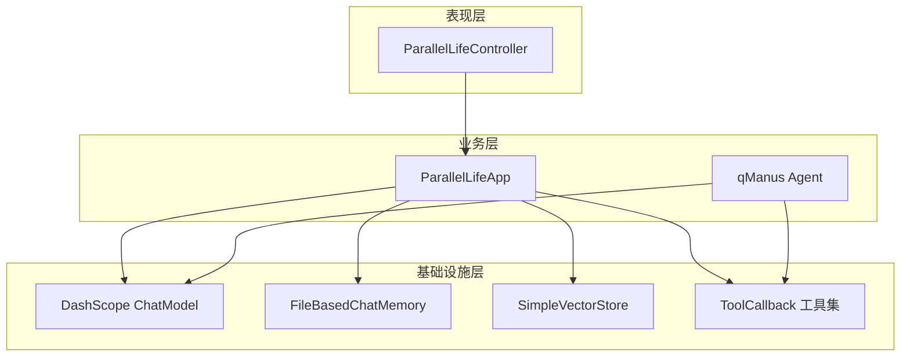

## 实验报告

---

## 一.实验内容与目的

### 1.1 选题背景

近年来，以大语言模型（LLM）为代表的人工智能技术快速发展，「AI + 应用」已成为软件工程专业重要的实践方向。人生规划、职业选择等问题具有多解性，用户往往希望在做出重大决策前，能够从多个角度预览不同选择的可能后果。本课题将 LLM 的生成能力与检索增强、工具调用相结合，构建「平行宇宙人生模拟器」，为用户提供多路径人生推演与知识库支撑的分析服务。

### 1.2 设计目的与意义

1. 掌握 **Spring Boot** 企业级后端开发与 **RESTful API** 设计方法；  
2. 理解 **RAG**、**ChatMemory**、**Function Calling / Tool** 等 AI 应用常见模式；  
3. 在课程设计范围内完成 **可运行、可演示、可测试** 的完整项目，培养团队协作与文档撰写能力；  
4. 为后续扩展（数据库持久化、多步 Agent 编排）预留架构空间。

### 1.3 主要研究内容与目标

| 序号 | 研究内容 | 预期目标 |
| --- | --- | --- |
| 1 | 多轮对话与流式接口 | 支持按 `chatId` 维持上下文，前端可 SSE 拉流 |
| 2 | RAG 知识库问答 | 结合人生规划、职业发展等领域文档增强回答 |
| 3 | 工具调用能力 | 文件读写、联网搜索、PDF 生成等，并保证安全 |
| 4 | 结构化报告输出 | 将模型输出映射为 Java Record 类型 |
| 5 | 工程规范 | 统一响应体、全局异常处理、基础单元测试 |

---

## 二.需求分析

### 2.1 功能性需求

| 编号 | 需求描述 | 优先级 |
| --- | --- | --- |
| F1 | 用户输入现状或决策问题，系统返回多平行宇宙路径分析 | 高 |
| F2 | 支持同一会话多轮对话，记住历史上下文 | 高 |
| F3 | 可选开启 RAG，从本地知识库检索相关内容 | 高 |
| F4 | 可选开启工具，由模型自主调用搜索、写文件等 | 中 |
| F5 | 生成结构化平行人生报告（JSON 映射为对象） | 中 |
| F6 | 提供会话创建、快速对话等便捷接口 | 中 |

### 2.2 非功能性需求

| 编号 | 需求描述 |
| --- | --- |
| NF1 | 工具调用需防止路径穿越、命令注入等安全风险 |
| NF2 | API 返回格式统一，便于前端解析 |
| NF3 | 敏感配置（如搜索 API Key）不得硬编码在仓库 |
| NF4 | 系统应能在 Windows 开发环境下通过 Maven 构建与测试 |

### 2.3 可行性分析

- **技术可行性**：Spring AI Alibaba 已提供 `ChatClient`、Advisor、VectorStore、Tool 等抽象，降低接入成本。  
- **经济可行性**：采用阿里云 DashScope 按量计费，课程实验规模下成本可控。  
- **操作可行性**：提供 Knife4j 接口文档，支持 Postman / 前端联调。

---

## 三.系统设计

### 3.1 总体架构设计

系统采用经典 **三层结构**：表现层（Controller）→ 业务层（App / Agent）→ 基础设施层（记忆、向量库、工具、大模型）。用户请求经控制器分发至 `ParallelLifeApp`，由 `ChatClient` 串联 Advisor 与工具，最终调用 DashScope 模型。



### 3.2 功能模块划分

| 模块 | 主要类 | 功能说明 |
| --- | --- | --- |
| 对话模块 | `ParallelLifeApp` | 基础对话、流式、RAG、工具、结构化报告 |
| 接口模块 | `ParallelLifeController` | REST API、参数校验、模式分支 |
| 记忆模块 | `FileBasedChatMemory` | 按会话 ID 持久化消息列表 |
| 知识库模块 | `ParallelLifeDocumentLoader`、`ParallelLifeVectorStoreConfig` | Markdown 加载与向量索引 |
| 工具模块 | `ToolRegistration` 及 7 个 Tool 类 | 向模型注册可调用工具 |
| Agent 模块 | `ToolCallAgent`、`qManus` | 多步 ReAct 自主规划（实验扩展） |
| 公共模块 | `Result`、`GlobalExceptionHandler` | 统一响应与异常处理 |

### 3.3 数据库与持久化设计（规划说明）

课程设计当前阶段以 **文件记忆 + 内存向量库** 为主。项目组已在文档中完成 **PostgreSQL + pgvector 单库** 三层记忆表结构设计，作为课程结束后的演进方向，本版本代码尚未接入 JDBC。

---

## 四.系统实现与关键代码

本章结合核心源码说明实现思路。代码摘录均来自本仓库 `src/main/java` 目录。

### 4.1 统一 API 入口与多模式分发

控制器根据请求参数 `useRag`、`useTools` 选择不同业务方法，实现「一个接口、多种能力」的开关式设计。

```36:47:src/main/java/com/qin/qaiagentproject/controller/ParallelLifeController.java
    public Flux<String> chatStream(@Valid @RequestBody ChatRequest request) {
        log.info("收到流式对话请求: chatId={}, message={}, useRag={}, useTools={}", 
                request.getChatId(), request.getMessage(), request.getUseRag(), request.getUseTools());
        
        if (Boolean.TRUE.equals(request.getUseTools())) {
            return parallelLifeApp.doChatWithToolsStream(request.getMessage(), request.getChatId());
        } else if (Boolean.TRUE.equals(request.getUseRag())) {
            return parallelLifeApp.doChatWithRagStream(request.getMessage(), request.getChatId());
        } else {
            return parallelLifeApp.doChatStream(request.getMessage(), request.getChatId());
        }
    }
```

### 4.2 对话应用层：ChatClient 与人设 Prompt

`ParallelLifeApp` 在构造时绑定系统人设、文件记忆 Advisor、日志与违禁词 Advisor。基础对话通过 `chatId` 关联历史消息。

```68:79:src/main/java/com/qin/qaiagentproject/app/ParallelLifeApp.java
    public ParallelLifeApp(ChatModel dashscopeChatModel) {
        // 初始化基于文件的对话记忆
        String fileDir = System.getProperty("user.dir") + "/tmp/chat-memory";
        ChatMemory chatMemory = new FileBasedChatMemory(fileDir);
        chatClient = ChatClient.builder(dashscopeChatModel)
                .defaultSystem(SYSTEM_PROMPT)
                .defaultAdvisors(
                        new MessageChatMemoryAdvisor(chatMemory),
                        new MyLoggerAdvisor(),
                        new ForbiddenWordAdvisor()
                )
                .build();
    }
```

```108:118:src/main/java/com/qin/qaiagentproject/app/ParallelLifeApp.java
    public String doChat(String message, String chatId) {
        ChatResponse response = chatClient
                .prompt()
                .user(message)
                .advisors(spec -> spec.param(CHAT_MEMORY_CONVERSATION_ID_KEY, chatId)
                        .param(CHAT_MEMORY_RETRIEVE_SIZE_KEY, 30))
                .call()
                .chatResponse();
        String content = response.getResult().getOutput().getText();
        log.info("content: {}", content);
        return content;
    }
```

### 4.3 RAG 增强对话实现

在基础对话之上叠加 `QuestionAnswerAdvisor`，从 `parallelLifeVectorStore` 检索相关片段并注入上下文。

```156:170:src/main/java/com/qin/qaiagentproject/app/ParallelLifeApp.java
    public String doChatWithRag(String message, String chatId) {
        ChatResponse chatResponse = chatClient
                .prompt()
                .user(message)
                .advisors(spec -> spec.param(CHAT_MEMORY_CONVERSATION_ID_KEY, chatId)
                        .param(CHAT_MEMORY_RETRIEVE_SIZE_KEY, 30))
                .advisors(new MyLoggerAdvisor())
                .advisors(new QuestionAnswerAdvisor(parallelLifeVectorStore))
                .call()
                .chatResponse();
        String content = chatResponse.getResult().getOutput().getText();
        log.info("content: {}", content);
        return content;
    }
```

向量库在应用启动时由配置类创建，并加载 `classpath:document/` 下全部 Markdown：

```19:27:src/main/java/com/qin/qaiagentproject/rag/ParallelLifeVectorStoreConfig.java
    @Bean
    VectorStore parallelLifeVectorStore(EmbeddingModel dashscopeEmbeddingModel) {
        SimpleVectorStore simpleVectorStore = SimpleVectorStore.builder(dashscopeEmbeddingModel)
                .build();
        List<Document> documents = parallelLifeDocumentLoader.loadMarkdowns();
        simpleVectorStore.add(documents);
        return simpleVectorStore;
    }
```

### 4.4 工具调用与工具注册

所有工具通过 `ToolRegistration` 统一注册为 `ToolCallback[]`，供 `ParallelLifeApp.doChatWithTools` 使用。

```22:39:src/main/java/com/qin/qaiagentproject/tools/ToolRegistration.java
    @Bean
    public ToolCallback[] allTools() {
        FileOperationTool fileOperationTool = new FileOperationTool();
        WebSearchTool webSearchTool = new WebSearchTool(searchApiKey);
        WebScrapingTool webScrapingTool = new WebScrapingTool();
        ResourceDownloadTool resourceDownloadTool = new ResourceDownloadTool();
        TerminalOperationTool terminalOperationTool = new TerminalOperationTool(terminalToolProperties);
        PDFGenerationTool pdfGenerationTool = new PDFGenerationTool();
        TerminateTool terminateTool = new TerminateTool();
        return ToolCallbacks.from(
            fileOperationTool,
            webSearchTool,
            webScrapingTool,
            resourceDownloadTool,
            terminalOperationTool,
            pdfGenerationTool,
                terminateTool
        );
    }
```

### 4.5 对话记忆：基于 Kryo 的文件持久化

每个会话对应目录下的 `{chatId}.kryo` 文件，实现跨重启的多轮记忆。

```42:56:src/main/java/com/qin/qaiagentproject/chatmeomery/FileBasedChatMemory.java
    @Override
    public void add(String conversationId, List<Message> messages) {
        List<Message> conversationMessages = getOrCreateConversation(conversationId);
        conversationMessages.addAll(messages);
        saveConversation(conversationId, conversationMessages);
    }

    @Override
    public List<Message> get(String conversationId, int lastN) {
        List<Message> allMessages = getOrCreateConversation(conversationId);
        return allMessages.stream()
                .skip(Math.max(0, allMessages.size() - lastN))
                .toList();
    }
```

### 4.6 工具安全：文件操作防路径穿越

文件工具限制文件名格式，并通过 `Path.normalize()` 保证解析路径不逃逸出工作目录。

```52:65:src/main/java/com/qin/qaiagentproject/tools/FileOperationTool.java
    private File resolveSafeFile(String fileName) {
        if (fileName == null || fileName.isBlank()) {
            throw new BusinessException(ErrorCode.BAD_REQUEST, "File name must not be empty.");
        }
        if (!SAFE_FILE_NAME.matcher(fileName).matches()) {
            throw new BusinessException(ErrorCode.BAD_REQUEST, "Invalid file name.");
        }
        Path basePath = Paths.get(FILE_DIR).toAbsolutePath().normalize();
        Path targetPath = basePath.resolve(fileName).normalize();
        if (!targetPath.startsWith(basePath)) {
            throw new BusinessException(ErrorCode.BAD_REQUEST, "Invalid file path.");
        }
        return targetPath.toFile();
    }
```

### 4.7 工具安全：终端命令白名单与危险字符过滤

终端工具默认在配置中关闭；开启后仍须通过白名单与字符黑名单校验。

```25:45:src/main/java/com/qin/qaiagentproject/tools/TerminalOperationTool.java
    @Tool(description = "Execute a command in the terminal")
    public String executeTerminalCommand(@ToolParam(description = "Command to execute in the terminal") String command) {
        validateToolEnabled();
        String normalizedCommand = normalizeAndValidateCommand(command);
        return executeWhitelistedCommand(normalizedCommand);
    }

    private void validateToolEnabled() {
        if (!terminalToolProperties.isEnabled()) {
            throw new BusinessException(ErrorCode.FORBIDDEN, "Terminal tool is disabled by configuration.");
        }
    }

    private String normalizeAndValidateCommand(String command) {
        if (command == null || command.isBlank()) {
            throw new BusinessException(ErrorCode.BAD_REQUEST, "Command must not be empty.");
        }
        String trimmedCommand = command.trim();
        if (trimmedCommand.matches(DANGEROUS_CHARS_REGEX)) {
            throw new BusinessException(ErrorCode.BAD_REQUEST, "Command contains unsafe characters and was rejected.");
        }
```

对应配置（`application.yml`）：

```yaml
tool:
  terminal:
    enabled: false
    allowed-commands:
      - dir
      - echo
      - type
      - findstr
```

### 4.8 全局异常处理与统一响应

业务异常由 `BusinessException` 表达，经 `GlobalExceptionHandler` 转换为前端可识别的 `Result` 结构。

```46:50:src/main/java/com/qin/qaiagentproject/exception/GlobalExceptionHandler.java
    @ExceptionHandler(BusinessException.class)
    public Result<?> handleBusinessException(BusinessException e) {
        log.warn("业务异常: code={}, message={}", e.getCode(), e.getMessage());
        return Result.error(e.getCode(), e.getMessage());
    }
```

### 4.9 自主 Agent 扩展（qManus）

课程设计中额外实现 `qManus` 智能体，继承 `ToolCallAgent`，支持最多 20 步工具循环，为后续「AgentLoop 编排层」积累代码基础。

```15:30:src/main/java/com/qin/qaiagentproject/agent/qManus.java
    public qManus(ToolCallback[] allTools, ChatModel dashscopeChatModel) {
        super(allTools);  
        this.setName("qManus");
        String SYSTEM_PROMPT = """  
                You are qManus, an all-capable AI assistant, aimed at solving any task presented by the user.  
                You have various tools at your disposal that you can call upon to efficiently complete complex requests.  
                """;  
        this.setSystemPrompt(SYSTEM_PROMPT);
        // ...
        this.setMaxSteps(20);  
        ChatClient chatClient = ChatClient.builder(dashscopeChatModel)
                .defaultAdvisors(new MyLoggerAdvisor())
                .build();  
        this.setChatClient(chatClient);  
    }
```

---

## 五.系统测试

### 5.1 测试环境

| 项目 | 配置 |
| --- | --- |
| 操作系统 | Windows 10 |
| JDK | 21 |
| 构建工具 | Maven 3.9.x |
| 服务端口 | 8123（context-path: `/api`） |
| 测试框架 | JUnit 5 + Spring Boot Test |

### 5.2 测试用例设计

| 用例编号 | 测试项 | 输入 / 操作 | 预期结果 |
| --- | --- | --- | --- |
| TC-01 | 应用启动 | 运行 `QAiAgentProjectApplicationTests` | Spring 容器启动成功 |
| TC-02 | 非法文件名 | `readFile("../a.txt")` | 返回 400，提示 Invalid file name |
| TC-03 | 文件不存在 | 读取随机文件名 | 返回 404 |
| TC-04 | 终端禁用 | `enabled=false` 时执行命令 | 返回 403 |
| TC-05 | 命令注入字符 | `echo hello & whoami` | 返回 400 |
| TC-06 | 白名单外命令 | 执行 `dir`（白名单仅 echo） | 返回 403 |

### 5.3 测试过程与结果

在实验机执行：

```bash
mvn -q test "-Dtest=FileOperationToolTest,TerminalOperationToolTest,QAiAgentProjectApplicationTests"
```

**测试结果**：全部通过（退出码 0）。

| 测试类 | 用例数 | 结果 |
| --- | --- | --- |
| `FileOperationToolTest` | 2 | 通过 |
| `TerminalOperationToolTest` | 3 | 通过 |
| `QAiAgentProjectApplicationTests` | 1 | 通过 |

### 5.4 功能演示测试（手工）

| 演示项 | 操作说明 | 观察现象 |
| --- | --- | --- |
| 基础对话 | POST `/api/parallel-life/chat` | 返回多平行宇宙路径文本 |
| 流式对话 | POST `/api/parallel-life/chat/stream` | SSE 逐字输出 |
| RAG 模式 | `useRag=true` | 回答可引用知识库中的方法论表述 |
| 工具模式 | `useTools=true` | 日志可见工具调用记录 |
| 多轮记忆 | 同一 `chatId` 连续提问 | 模型能联系上一轮话题 |

> 说明：依赖真实大模型 API 的端到端测试受网络与配额影响，课程答辩以 **接口可调通 + 单元测试通过** 为主要验收依据。

### 5.5 测试分析与遗留问题

1. 应用启动时需对 6 份 Markdown 逐段 Embedding，全量测试耗时约 20～30 秒，后续可改为懒加载或测试环境 Mock。  
2. Jakarta Validation 依赖未完整引入，部分 `@Valid` 校验可能降级，建议在下一版本补充 `hibernate-validator`。  
3. 三层记忆数据库、AgentLoop 编排尚未编码，不在本次测试范围内。

---

## 六.总结与展望

### 6.1 工作总结

本课程设计完成了「平行宇宙人生模拟器」后端主体开发：实现了多模式对话 API、RAG 知识库、工具调用、文件化会话记忆及统一异常体系；通过单元测试验证了工具层安全防护的有效性。项目技术栈与当前 Java 后端及 AI 应用开发方向一致，具备答辩演示与文档展示条件。

### 6.2 不足与改进方向

| 方面 | 现状 | 改进计划 |
| --- | --- | --- |
| 数据持久化 | Kryo 文件 + 内存向量 | 接入 PostgreSQL + pgvector |
| 记忆体系 | 单一会话文件 | 实现热 / 温 / 冷三层记忆与异步提炼 |
| Agent 编排 | 仅独立 `qManus` 类 | 实现 `ParallelLifeAgentLoop` 与 `ContextManager` |
| 测试覆盖 | 以工具安全为主 | 增加 Mock ChatModel 的结构化输出测试 |

### 6.3 展望

后续可在单库 PostgreSQL 方案上跑通三层记忆闭环，并将 Agent 多步推理与上下文拼装统一到 `ContextManager`，使系统从「课程设计 Demo」演进为可部署的 AI 应用服务。

---

## 七.小组成员体会

### 7.1 乔思齐

通过本次课程设计，我主要负责前后端联调与接口文档方面的工作。最初在使用 Postman 调用流式接口时，对 `TEXT_EVENT_STREAM` 的响应处理不熟悉，经常出现前端只能等到整段结束才显示的问题。后来在队友帮助下改用 EventSource 消费 SSE，才真正体会到流式输出的价值。我认为本项目的 API 设计把 `useRag`、`useTools` 做成开关非常实用，降低了演示复杂度。体会最深的一点是：**AI 应用不只是调一个大模型接口，而是要把记忆、检索、工具、异常处理都当成系统工程来做**。今后希望继续参与前端交互优化，把平行宇宙报告用更直观的图表展示出来。

### 7.2 曹宇声

我在本项目中侧重于 RAG 知识库与测试相关的工作。整理 `classpath:document/` 下的 Markdown、按章节拆分文档时，发现文档质量直接影响检索效果——标题层级混乱会导致向量切片语义不完整。我们还讨论了是否要上 pgvector，最终课程阶段先用 `SimpleVectorStore` 保证功能跑通，这个取舍让我理解了**先闭环、再优化**的开发节奏。写 `FileOperationToolTest`、`TerminalOperationToolTest` 时，我也认识到安全测试和功能性测试同样重要：一条 `../` 路径就可能让 Agent 读到不该读的文件。总的来说，这次实践让我把课堂上学的 RAG 流程真正落到了代码里，也培养了我写测试用例的习惯。

### 7.3 秦健超

作为后端核心实现的主要承担者，我感受最深的是 Spring AI 抽象层带来的效率：`ChatClient` 与 Advisor 链式组合，让我们较快搭出了对话、RAG、工具三条链路。与此同时，**工具调用带来的安全风险**也给我上了深刻一课——终端工具必须默认关闭并配合白名单，文件工具必须做路径规范化。实现 `FileBasedChatMemory` 时，Kryo 序列化虽然简单，但不利于跨版本升级，这也促使我们团队在文档中推进 PostgreSQL 方案。`qManus` 与 `ToolCallAgent` 的实现让我初步理解了 ReAct 循环，但要把多步 Agent 和三层记忆融合，还需要 `ContextManager` 统一拼装上下文，这是我认为项目最有价值、也最有挑战的下一步。感谢两位队友在联调和测试上的配合，让我体会到三人小组分工协作的重要性。


